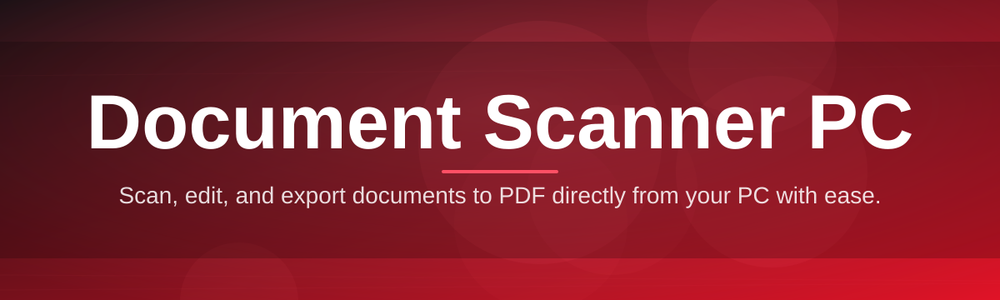
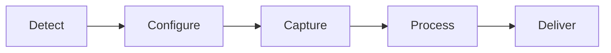

# 📠 document-scanner-configurator 🖥️

  

*Turn any Windows PC into a calibrated, driver-smart document scanning station — in minutes, not hours.*

  

## 🔍 Overview

Scanning documents shouldn't require a PhD in TWAIN drivers, WIA settings, or vendor bloatware that installs three toolbars you never asked for. **document-scanner-configurator** is a lightweight desktop configurator built specifically for the "Document Scanner PC" workflow — the dedicated machine sitting next to the scanner in an office, archive room, clinic, or home office, doing one job well: turning paper into clean, organized digital files.

This project exists because most scanner software is either tied to a single manufacturer's ecosystem or buried under enterprise licensing walls. We wanted a **universal, standalone configurator** that talks to whatever scanner is plugged in, exposes the settings that actually matter (DPI, color mode, duplex, output format), and gets out of your way. No accounts, no cloud lock-in, no subscription nag screens.

Whether you're digitizing a decade of paper invoices, setting up a shared scan station for a small team, or just tired of clicking through five dialog boxes to scan one receipt, this tool is built for you. It's aimed at office admins, archivists, students, freelancers, and anyone who has ever muttered "why is this so complicated" at a scanner dialog.

---

## ⚙️ What It Actually Does

> [!NOTE]
> Every capability below runs locally on your Document Scanner PC. Nothing is uploaded, nothing phones home.

- **Driver Auto-Discovery** — detects connected scanners over USB or network (TWAIN/WIA compatible) and lists them without you digging through Device Manager.

- **Batch Scan Profiles** — save named presets ("Invoices — 300 DPI Grayscale", "Photos — 600 DPI Color") and switch between them with one click instead of re-configuring every session.

- **Smart Duplex Handling** — automatically detects double-sided documents on capable hardware and merges front/back pages into the correct order.

- **Output Pipeline Control** — choose PDF, multi-page TIFF, PNG, or JPEG output, with configurable compression and naming templates (date, sequence, custom prefix).

- **Blank Page Skip** — a lightweight detection pass that drops blank backs from duplex scans so your archive doesn't fill up with empty pages.

- **Watch-Folder Routing** — point completed scans at a specific folder structure automatically, great for shared network drives on an office Document Scanner PC.

- **Preview & Crop Deskew** — quick visual preview before final save, with auto-deskew for pages that went in slightly crooked.

- **Portable Config Export** — export your entire scanner profile setup as a single file to clone the setup onto another PC in seconds.

---

## 🚀 How to Get Started

1. **Visit the landing page** — head to the download button above or below to reach the official project page.

2. **Download the installer** — grab the latest Windows build; it's a single standalone executable.

3. **Run the app** — launch it, plug in your scanner (or confirm it's already connected), and let auto-discovery do its thing.

4. **Pick or build a profile** — choose a preset or create your own scan profile, then hit Scan.

> [!TIP]
> First-time setup? Run the built-in **Quick Calibration Wizard** from the Settings menu — it walks through DPI and color balance in under two minutes.

---

## 🖥️ System Requirements

| Requirement | Details |
|---|---|
| OS | Windows 10 or Windows 11 (64-bit) |
| Dependencies | None — fully standalone executable |
| Scanner Interface | TWAIN or WIA compliant device (USB or network) |
| Disk Space | ~150 MB for app, plus space for scanned output |
| RAM | 4 GB minimum, 8 GB recommended for large batch jobs |

> [!IMPORTANT]
> This is a **standalone Windows application**. It does not require .NET runtime installs, cloud accounts, or third-party frameworks pre-installed.

---

## 🧩 How It Works

The configurator sits between the physical scanner hardware and your output folder, acting as a translator and traffic controller:

1. **Detect** — the app polls connected TWAIN/WIA devices on launch.
2. **Configure** — you select or build a scan profile (resolution, color, duplex).
3. **Capture** — the scanner driver is triggered and pages stream in.
4. **Process** — deskew, blank-page skip, and compression run automatically.
5. **Deliver** — final files land in your chosen folder or watch-folder route.

---

## 🛟 Troubleshooting

<strong>My scanner isn't showing up in the device list.</strong>

Make sure the scanner's native driver (TWAIN or WIA) is installed by the manufacturer first — this configurator talks to that driver layer rather than replacing it. Reconnect the USB cable and hit "Refresh Devices" in the top toolbar.

<strong>Scans are coming out blurry or low quality.</strong>

Bump your DPI setting up in the active profile — 300 DPI is the sweet spot for text documents, 600 DPI for photos or fine print. Also check the lens/glass on your scanner isn't dusty.

<strong>Duplex pages are landing in the wrong order.</strong>

Run the Quick Calibration Wizard again — some feeder trays load face-up vs face-down inconsistently, and calibration re-maps the page order logic for your specific scanner model.

<strong>Output PDFs are huge in file size.</strong>

Lower the compression quality slider in Output Pipeline Control, or switch grayscale/text scans to a lower DPI — 300 DPI grayscale is usually plenty for legibility while keeping files small.

<strong>The app can't find my network scanner.</strong>

Confirm the scanner and PC are on the same subnet, and that the manufacturer's network scan service is running. Some enterprise scanners require the network module enabled separately in their own admin panel first.

---

## 🎨 UI / UX Details

- **Themes** — Light, Dark, and an automatic "Follow System" mode.

- **Keyboard Shortcuts**:

  | Shortcut | Action |
  |---|---|
  | `Ctrl+S` | Scan with active profile |
  | `Ctrl+N` | New scan profile |
  | `Ctrl+E` | Export current profile |
  | `Ctrl+P` | Open preview pane |
  | `F5` | Refresh device list |

- **Settings Panel** — persistent per-user config stored locally; no roaming profile required.

- **Live Preview Pane** — scales dynamically with window resizing, supports zoom via scroll wheel.

> [!WARNING]
> Switching themes mid-scan job is safe, but avoid closing the app while a batch scan is actively writing files — always let a job finish or cancel it cleanly from the toolbar.

---

## 🤝 Contributing & Community

We'd love your help making document-scanner-configurator better for every kind of Document Scanner PC setup out there — home office, small business, or archive room.

- Open an issue for bugs or feature ideas.

- Submit a pull request — please keep changes focused and documented.

- Join discussions to share scan profiles, driver quirks, or workflow tips.

  

> [!TIP]
> Good first issues are tagged `good-first-issue` — great entry point if this is your first open-source contribution.

---

## 📄 License

Released under the [MIT License](LICENSE), 2026. Use it, fork it, build on it — just keep the license notice intact.

---

## ⚠️ Disclaimer

This tool is provided as-is, without warranty of any kind. It is designed to work alongside your scanner manufacturer's own drivers and software, not to replace or circumvent them. Always follow your organization's data handling and document retention policies when scanning sensitive material. The maintainers are not responsible for data loss, hardware compatibility issues, or misconfigured scan profiles.

